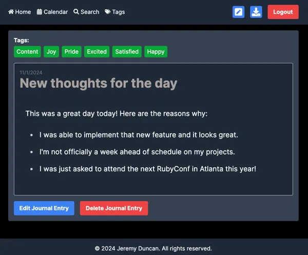

# Project Documentation: Blog Frontend with Next.js, React, and TypeScript

## Overview
This project is a blog frontend built using Next.js, React, and TypeScript. The application provides features such as authentication, post creation, editing, and listing, along with pagination, calendar integration, and styling using Tailwind CSS. Below is a detailed explanation of the project structure, key components, and important code snippets.

## Table of Contents
- [Project Structure](#project-structure)
- [Key Components and Pages](#key-components-and-pages)
    - [Authentication with NextAuth](#authentication-with-nextauth)
    - [Login Page](#login-page)
    - [Home Page](#home-page)
    - [Journal Page](#journal-page)
    - [Calendar Page](#calendar-page)
    - [Search Page](#search-page)
    - [Tags Page](#tags-page)
        - [TagTypes](#tagtypes)
        - [Tags](#tags)
    - [Create Journal Page](#create-journal-page)
- [Project Dependencies](#project-dependencies)
- [Getting Started](#getting-started)
- [Conclusion](#conclusion)

## Project Structure

The project is structured as follows:

- **app/**: This is the main application directory where Next.js pages and API routes are defined.
    - **api/**: Contains backend API routes, including authentication.
        - **auth/**: Handles user authentication using NextAuth.
    - **calendar/**: Contains the calendar page.
    - **components/**: Reusable React components.
        - **layout/**: Contains layout components such as headers and protected routes.
    - **login/**: Login page for user authentication.
    - **posts/**: Contains pages and components related to blog posts.
        - **[id]/**: Handles dynamic routing for individual post pages.
    - **search/**: Contains the search page.
    - **styles/**: Global styles for the application.
    - **tags/**: Contains pages related to tags.
    - **_app.tsx**: Custom App component for the Next.js application, handling global providers and styles.
    - **layout.tsx**: Global layout component for the application.
    - **page.tsx**: The main page of the application, typically the homepage or a specific page.

- **lib/**: Utility functions and types used throughout the project.
- **public/**: Static assets such as images and favicon.
- **node_modules/**: Contains project dependencies.
- **.env.local**: Environment variables specific to this project.
- **.eslintrc.json**: Configuration file for ESLint.
- **tailwind.config.mjs**: Configuration file for Tailwind CSS.
- **tsconfig.json**: TypeScript configuration file.
- **yarn.lock**: Yarn lock file to ensure consistent dependency versions.

## Key Components and Pages

### Authentication with NextAuth (`app/api/auth/[...nextauth]/route.ts`)
This file sets up NextAuth for handling authentication using credentials (email and password). It integrates with an external API to verify user credentials and manage sessions using JWT tokens. The sign-in and error pages are customized to route to the `/login` page.

```typescript
import NextAuth from 'next-auth';
import CredentialsProvider from 'next-auth/providers/credentials';

const handler = NextAuth({
// Configuration details
});

export { handler as GET, handler as POST };
```

### Login Page
This page handles both user login and registration. Depending on the user's action (login or register), it communicates with the backend to either sign in the user or create a new account. The page includes form validation and displays appropriate success or error messages based on the operation.


### Home Page (`app/page.tsx`)
The homepage displays a list of blog posts, supports pagination, and includes a link to create a new post. It fetches posts from the backend and formats the content for preview, handling tag display and date formatting.


```typescript
export default function Home() {
// State and logic for fetching posts and rendering pagination
return (
<div className="container mx-auto p-4 bg-gray-700 mt-4 mb-4 rounded">
{/* Page content */}
</div>
);
}
```

### Journal Page
This page allows users to view detailed entries of their journal posts. It displays the full content of a post, along with tags and other relevant metadata like creation date. Users can also edit or delete posts directly from this page.



### Calendar Page (`app/calendar/page.tsx`)
The calendar page offers a calendar view of blog posts, allowing users to see which posts were made on specific dates. It supports filtering by tags and displays posts in a modal when a date is clicked. The page uses a combination of React hooks and third-party libraries like `react-calendar` and `date-fns` to manage state and format dates.

```typescript
import React, { useState, useEffect, useRef } from 'react';
import Calendar from 'react-calendar';
// Additional imports...
const CalendarView: React.FC = () => {
    // Component logic...
};
export default CalendarView;
```


### Search Page (`app/search/page.tsx`)
The search page allows users to search for blog posts by text, tags, or tag types. It features a paginated list of search results and provides a dynamic search experience with a debounce function to reduce the number of API calls.


### Tags Page (`app/tags/page.tsx`)
This page manages tags and tag types used in the blog. Users can create new tags and tag types, delete existing ones, and change the color associated with a tag type. The page also displays existing tags organized by their tag types.


### Create Journal Page (`app/posts/new/page.tsx`)
This page is used for creating new journal entries. It features a rich text editor (using `react-quill`) for writing content and options to select or create tags. Users can also specify the creation date for a post, which is particularly useful when backdating entries.


## Tailwind CSS Configuration (`tailwind.config.mjs`)
This configuration file customizes Tailwind CSS for the project. It extends the default theme to include specific color settings and typography styles tailored for the blog's design. The typography plugin is utilized to ensure consistent styling across all text elements.

```typescript
const config: Config = {
theme: {
extend: {
typography: (theme) => ({
DEFAULT: {
css: {
color: theme('colors.white'),
// Additional style overrides
},
},
}),
},
},
plugins: [require('@tailwindcss/typography')],
};
export default config;
```

## Project Dependencies

- **Main Dependencies**:
    - `next`: The core framework used to build this application.
    - `react`, `react-dom`: React libraries for building user interfaces.
    - `next-auth`: Authentication library for Next.js.
    - `date-fns`: Utility library for manipulating dates.
    - `tailwindcss`: Utility-first CSS framework for styling.
    - `react-hook-form`: Library for managing form state and validation.
    - Additional libraries like `dompurify`, `file-saver`, `quill` are used for sanitizing HTML, saving files, and rich text editing.

- **Development Dependencies**:
    - `typescript`: TypeScript support.
    - `eslint`, `eslint-config-next`: Linting tools for maintaining code quality.

## Getting Started

1. **Installation**:
    - Clone the repository and navigate to the project directory.
    - Install dependencies using Yarn:

   ```bash
   yarn install
   ```

2. **Environment Variables**:
    - Set up environment variables in `.env.local`. Required variables include:
        - `NEXT_PUBLIC_API_URL`
        - `NEXT_PUBLIC_API_KEY`
        - `NEXTAUTH_SECRET`

3. **Running the Project**:
    - Start the development server:

   ```bash
   yarn dev
   ```

    - Build the project for production:

   ```bash
   yarn build
   yarn start
   ```